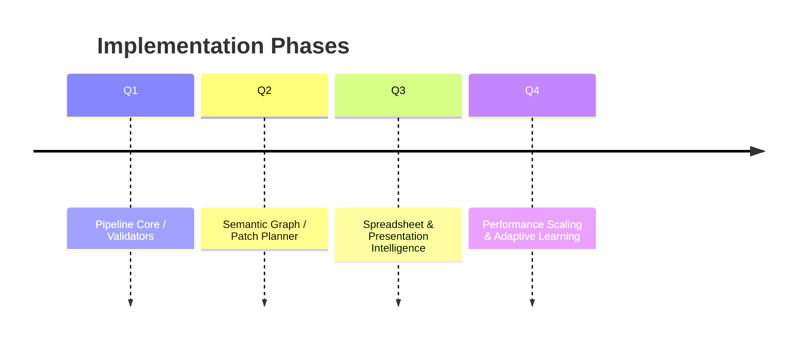

# Executive Agent Roadmap

Enabling multi-artifact, high-quality document intelligence.

---
layout: center
class: text-center

# Vision

Deliver adaptive, validated DOCX / XLSX / PDF / PPTX assets with contextual memory and safety guardrails.

---
# Phases

---
# Pipeline Stages

PLAN → RENDER → REVIEW (multi-pass) → COMMIT → POSTLOG.

- Structured planning outline
- Iterative rendering with localized edits
- Multi-pass validation & scoring
- Patch prioritization
- Provenance logging & impact ledger

---
# Context Architecture

Semantic Graph Nodes:
- Section / Paragraph / Table / KPI / Clause / Figure
- Cross-artifact linkage & salience scoring
- Constraint propagation for style & compliance

---
# Quality Evaluation Loop

Composite scoring dimensions:
- Structure
- Style & Tone
- Readability
- Semantic Coherence
- KPI Accuracy
- Accessibility

Benefit/Cost patch prioritization ensures highest leverage improvements first.

---
# Safety Guardrails

- Clause Whitelist & Redaction Filters
- Schema Drift Monitor
- Fallback Strategy Matrix
- Budget & Anomaly Tracking
- Snapshot-based Rollbacks

---
# Spreadsheet Intelligence

- Formula Synthesis & Named Ranges
- Pivot / Aggregation Inference
- Chart Recommendation Engine
- Scenario Modeling Blocks

---
# Presentation Generation

Slide Taxonomy:
- Cover, Agenda, Section Gate, Deep Dive, Summary, KPI Spotlight, Risk Register, Roadmap Next

Automated theme styling + accessibility tagging.

---
# PDF Advanced Features

- Tagged structure
- Bookmarks & Outline
- Annotation Layer hooks
- Watermark / Signature placeholders

---
# Future Intelligence

- Adaptive Style Learning
- Predictive Suggestions
- Multi-Agent Orchestration
- KPI Scenario Intelligence

---
layout: center
class: text-center

# Next Steps

Implement runtime modules:
1. Pipeline Orchestrator
2. Graph Builder
3. Validator Suite
4. Patch Planner
5. Slidev Export API

---
layout: center
class: text-center

# Thank You

Questions? Explore specs & begin implementation.
